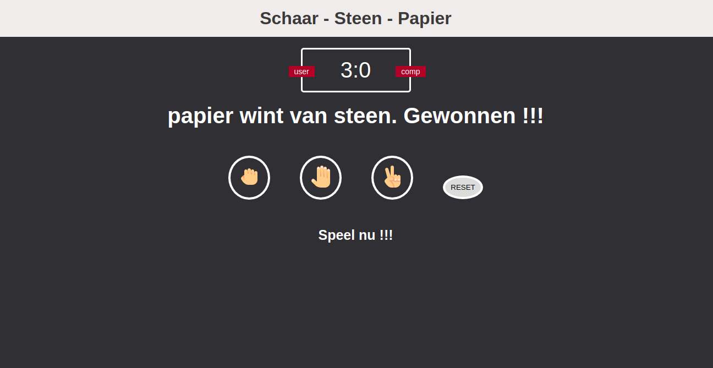

# SCHAAR - STEEN - PAPIER

This is a game in Dutch ('Rock - Paper - Scissors' in English)

[SCHAAR - STEEN - PAPIER](https://nicplackle.github.io/Schaar-steen-papier/ "Play the game")

## Who made it?

It was made by me following an online tutorial.

## What software did I use?

- HTML
- CSS
- Javascript

## What does it look like?



## Some code

```javascript
function getComputerChoice() {
  const choices = ["steen", "schaar", "papier"];
  const randomNumber = Math.floor(Math.random() * 3);
  return choices[randomNumber];
}
```

Above you will see a little piece of code which will make the computer's choice random and round off to the integer below.
